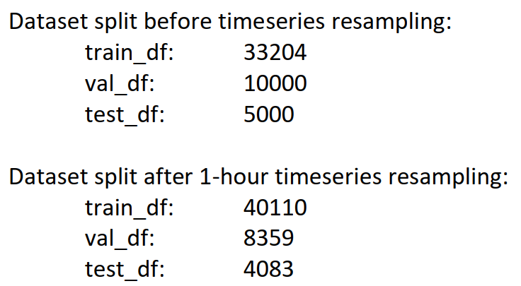

<h1 align="center">
  Phân tích, xử lý và dự đoán lưu lượng giao thông dựa trên bộ dữ liệu trực tuyến
</h1>
<h1>Yêu cầu </h1>
<p>
Python 3.10.9</p>
<p>
Ubuntu 22.04.2 
</p>
<h1>
  Hướng dẫn chạy code
</h1>
<p>Chạy lệnh bên dưới đây để tải toàn bộ code về máy</p>

```sh
git clone https://github.com/tomsu12/Traffic_flow_prediction.git
```

<p> Di chuyển đến thư mục mình cần làm việc</p>

```sh
cd Traffic_prediction1
```

<p>Tiếp theo bạn run từng dòng code  </p>

<br/>


<p> Dự đoán lưu lượng giao thông (TFP) có nghĩa là dự đoán khối lượng và mật độ của lưu lượng giao thông, thường là để kiểm soát chuyển động của phương tiện, giảm ùn tắc giao thông và tạo tuyến đường tối ưu (ít tốn thời gian hoặc năng lượng nhất). Với những tiến bộ gần đây trong Trí tuệ nhân tạo, Học máy (ML), Học sâu (DL) và Dữ liệu lớn, nghiên cứu trong lĩnh vực dự đoán lưu lượng giao thông đã được mở rộng một cách rộng rãi.</p>
<p> TFP là thành phần chính của Hệ thống giao thông thông minh (ITS) và có thể hỗ trợ ITS dự báo lưu lượng giao thông. Các thành phố lớn có quy định giao thông cực kỳ khó khăn. nhiều quốc gia đã áp dụng ITS để giảm chi phí liên quan đến tắc nghẽn giao thông. Nghiên cứu này xem xét ứng dụng của mạng nơ ron nhân tạo (ANN), ML, DL và các kỹ thuật, mô hình khác cho TFP. Cuối cùng, chúng tôi sẽ đề xuất mô hình dự đoán của riêng mình bằng DL, huấn luyện và kiểm tra mô hình đó, phân tích độ chính xác và so sánh độ chính xác của mô hình của chúng tôi với các mô hình khác.</p>
<p>So với các phương pháp ML thông thường, các mô hình DL có những ưu điểm như đơn giản hóa quy trình tiền xử lý dữ liệu và vượt trội so với các phương pháp ML khác về độ chính xác. Do đó, dự đoán luồng lưu lượng dựa trên dữ liệu do có sẵn dữ liệu lưu lượng lớn và các sơ đồ DL do quy trình tiền xử lý dữ liệu đã nhận được sự quan tâm rộng rãi gần đây trong TFP.</p>
<p> Hơn nữa, trong những năm gần đây, dữ liệu sẵn có đã tăng lên rất nhiều cùng với sự phát triển của các thành phố thông minh. Quá trình hiện đại hóa này có thể có tác động tích cực đến mạng lưới giao thông trong lĩnh vực ITS, giảm thời gian đi lại, tăng năng suất và giảm thiểu tác động môi trường của các phương tiện. Các công nghệ ML và DL là các lĩnh vực phát triển nhanh để dự đoán lưu lượng truy cập. Tín hiệu giao thông, tai nạn, điều kiện thời tiết và sửa chữa đường là những nguyên nhân chính của giao thông. Vì dữ liệu lưu lượng truy cập thời gian thực phần lớn được tạo ra theo cấp số nhân, nên các nguyên tắc dữ liệu lớn phải được sử dụng để cải thiện việc truyền dữ liệu. Thực tế này thúc đẩy chúng tôi dự đoán lưu lượng giao thông giữa Minneapolis và St. Paul tại một điểm cụ thể ở Minnesota. Mục tiêu của chúng tôi là xây dựng một mô hình Mạng Nural Định kỳ (RNN) gồm nhiều bước với mô hình Bộ nhớ Dài hạn Ngắn hạn (LSTM) tạo ra một điểm dự đoán duy nhất về lưu lượng truy cập trong 2 giờ tới trong tương lai, dựa trên khoảng thời gian 6 giờ trước đó.</p>


## 

 <a href="https://github.com/tomsu12/Traffic_flow_prediction.git">
     
     
      
     
      
     
     
     
      
     
  </a>
<p>Cảm ơn mọi người đã ghé thăm</p>
<p> TRẦN THỊ MINH ÁNH</p>
<P> CÔNG NGHỆ THÔNG TIN K 61</P>
